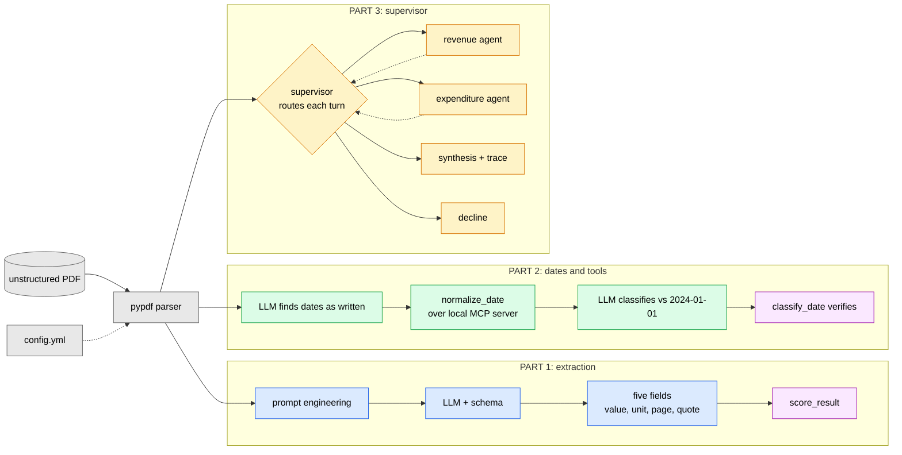

# Developing a multi-agent analyzer and document extractor

Extracting structured information from an unstructured document - the Singapore
MOF *Analysis of Revenue and Expenditure FY2024* - in three parts:

* Document extraction and prompting via LangChain
* Tool calling via a local MCP server
* Multi-agent supervisor via the LangGraph framework

## Contents

| Section | |
|---|---|
| [The three parts](#the-three-parts) | How the pieces fit together |
| [Instructions to implement](#instructions-to-implement) | Install, run each part, read the saved results |
| [Layout](#layout-and-dependencies) | What lives where, plus a link to dependencies |
| [API](#api) | Public entry points by module |
| [Parts 1-3](#parts-1-3) | Design and implementation, in `documentation/parts.md` |
| [Results](#results) | All three parts, all seven queries |
| [Limitations](#limitations) | Five, each a distinct failure mode |
| [Future work](#future-work) | |

## The three parts



## Instructions to implement

```bash
uv sync
cp .env.example .env          # add GROQ_API_KEY (free, no card)

uv run pytest                 # 236 tests, no key or network needed
uv run ruff check .

# Part 1 - extraction
uv run python -m src.extraction.extractor      # five fields, scored

# Part 2 - dates and tools
uv run python -m src.extraction.dates          # dates found and normalised
uv run python -m src.extraction.date_reasoning # classified vs 2024-01-01, checked

# Part 3 - supervisor
uv run python -m src.graph.workflow            # the required query, with trace
```

The source PDF is downloaded from the URL in `config.yml` on first use and
cached in `data/`, which is gitignored - a fresh clone needs only the config.

Each part also writes its answer to `results/`, which is committed, so every
output below can be read without running anything or spending API budget:

| File | Written by | Holds |
|---|---|---|
| `results/extraction.json` | `src.extraction.extractor` | The five fields, each with value, unit, page and quote |
| `results/dates.json` | `src.extraction.date_reasoning` | Both dates, normalised and classified, with the model's reasoning |
| `results/supervisor.json` | `src.graph.workflow` | The full trace: decisions, findings, citations, answer and node costs |


## Layout and dependencies

```
config.yml        # pdf url, page bindings, model, agent pages, reference date
.env              # GROQ_API_KEY (gitignored; see .env.example)
prompts/          # prompts for LLM and agents
expectations/     # known-correct values and the Part 3 query set
results/          # each part's answer, committed so it can be read
src/
  config.py       # config.yml + .env -> one settings object
  llm.py          # LLM for all parts
  evaluation.py   # Check/Report scoring for parts 1 and 2
  results.py      # save_json(): each part's answer -> results/
  ingestion/      # fetch the PDF, extract pages with --- page N --- markers
  extraction/     # parts 1 and 2: schemas, prompts, extraction, dates
  tools/          # part 2: the date tools, and the MCP server and client
  agents/         # part 3: the supervisor and the two specialists
  graph/          # part 3: state, the graph, the trace, and evaluation for part 3
tests/            # 236 tests; model stubbed, no network
```

Dependencies and why each is used: **[documentation/dependencies.md](documentation/dependencies.md)**.

## API

The public entry points, by module. Everything else is internal.

| Module | Function | Does |
|---|---|---|
| `src.config` | `load_config()` | `config.yml` + `.env` into one frozen settings object, validated at load |
| `src.llm` | `get_chat_model(config)` | The configured Groq model, temperature 0 |
| `src.ingestion.download` | `ensure_pdf(url)` | Downloads once, caches in `data/`, returns the path |
| `src.ingestion.parser` | `extract_pages(path, pages)` | Text of the given 1-indexed pages, each prefixed `--- page N ---` |
| | `page_of_quote(quote, text, claimed)` | The page whose section contains the quote, or `claimed` if none does |
| `src.extraction.extractor` | `extract(pdf_path, pages)` | Part 1: the five fields as an `ExtractionResult` |
| `src.extraction.dates` | `find_dates(pdf_path)` | Part 2 steps 2-3: both dates, normalised over MCP |
| `src.extraction.date_reasoning` | `classify(dates)` | Part 2 steps 4-5: status per date, verified against the tool |
| `src.tools.date_tool` | `normalize_date(text)` | A date in prose to ISO, or `None` |
| | `classify_date(iso, reference)` | Expired / Upcoming / Ongoing for one date |
| | `classify_period(start, end, reference)` | The same for a date range |
| `src.graph.workflow` | `run_query(query)` | Part 3: answers one query, returns the full `Trace` |
| | `stream_trace(query)` | The same run, printing each node's update live |
| `src.agents.supervisor` | `decide(state, model, config)` | One routing turn: the model chooses, `route()` guards it |
| `src.graph.evaluation` | `score_part3(trace, expected, config, pages)` | The five checks as one `Report` |
| `src.evaluation` | `score_result(result)` / `score_dates(results)` | Parts 1 and 2 against `expectations/expected.yaml` |
| `src.results` | `save_json(payload, path)` | Any result to JSON under `results/` |

Each part's module is runnable directly - `python -m src.graph.workflow` - which
is what the commands in [Instructions to implement](#instructions-to-implement)
do.


## Parts 1-3

Design, implementation and assumptions for each part:
**[documentation/parts.md](documentation/parts.md)**

| Part | Covers |
|---|---|
| [Part 1: extraction](documentation/parts.md#part-1-extraction) | Parser choice on measured evidence, the schema as an extraction contract, prompt engineering |
| [Part 2: dates and tools](documentation/parts.md#part-2-dates-and-tools) | The five steps, the MCP server and client, LLM reasoning checked by a tool |
| [Part 3: multi-agent supervisor](documentation/parts.md#part-3-multi-agent-supervisor) | LangGraph architecture, routing and its guard, one agent turn, the five checks |

## Results

Saved to `results/` by each part's `main()`, so the output can be read without
re-running anything.

| Part | Result | Detail |
|---|---|---|
| 1 - extraction | Pass | 5/5 fields correct on value, unit and page |
| 2 - dates | Pass | 2/2 normalised and classified correctly |
| 3 - supervisor | Pass | 5/5 on the required query |

In addition, for part 3, all seven demo queries were run against the current build:

| Query | Checks | Agents invoked | Notes |
|---|---|---|---|
| `revenue_only` | 5/5 | revenue | Two turns |
| `expenditure_only` | 5/5 | expenditure | Two turns |
| `required` | 5/5 | revenue, expenditure | Three turns |
| `collaboration` | 5/5 | expenditure, revenue | Three turns |
| `nirc_classification` | 4/5 | revenue, expenditure | Additional routing to expenditure was conducted, though not needed |
| `out_of_scope_sensible` | Declined | none | Correct |
| `out_of_scope_nonsense` | Declined | none | Correct |

Every citation verifies against the page it cites, and every figure keeps the
label its finding gave it. The single failing check is routing, where an
unnecessary agent cost a turn but not the answer - recorded under Known
limitations.

### Trace: the required query

The trace records the supervisor's process, not a log of which functions ran.
That takes four things: why it routed there (`reasoning`, stated before the
choice), that it *was* a choice (`chose` alongside `routed_to`), when the system
overruled it (`overridden`, naming the condition), and what each agent
contributed. A fixed chain would answer this query too and have no decisions in
it to trace.

`Trace.render()` prints six blocks - query, decisions, findings, citations,
answer, node costs. The decisions block is the one that makes it a decision
trace:

```
SUPERVISOR DECISIONS
turn  chose              routed to          why
--------------------------------------------------------------------------------
1     <route>            <route>            <the model's stated reasoning>
2     <route>            <route>            <the model's stated reasoning>
3     <route>            <route>            <the model's stated reasoning>
                         OVERRIDDEN:        <which condition fired, where they differ>

<n> decisions, <n> agents invoked, <n> overrides, <n> figures cited
```

Read together the six blocks show how the answer was reached: which routes were
taken and why, where the guard overruled the model, and which sentence in the
document every figure came from. The filled-in record is in
`results/supervisor.json`.

## Limitations

* Pages and target content must be defined up front to ensure that the LLM/agent is extracting the right data due to variations of data. This may not be feasible if future requests focus on specific topics without knowledge of pages 
* Routing is inconsistent between runs. As the routing logic is highly dependent on the supervisor agent, the same query can take a different path each time. Temperature 0 removes sampling, not server-side variation
* For this task, the reasoning in synthesis is not verified, as the focus is the accuracy of the extraction and the generated output. The labels check catches a figure renamed on its way into the answer, but an inference drawn from correct figures can still be wrong and pass every check - human review is what closes that gap
* Extraction and implementation is still very specific and dependent towards the source data
* The model's raw output is corrected before it is recorded - `page_of_quote` resolves a figure's page from its quote, and the synthesis prompt supplies the labels to reuse. Both are deliberate, but they mean the trace shows the corrected result rather than what the model first produced. How far the two diverge would be worth studying, but it is not the focus of this task and was not pursued

## Future work

* Retrieval over the whole document by removing hand-picked page sets and the document-specific schemas
* Persist results and traces onto a database rather than stored in local directory
* Extend scalability and adaptability of the solution into other documents
