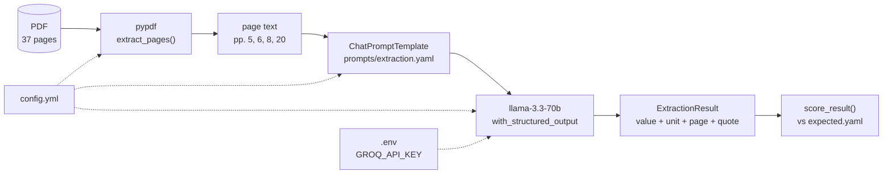

# structural-extanalyzer

Structured extraction from the Singapore MOF *Analysis of Revenue and
Expenditure FY2024*, using LangChain prompting, tool calling, and a LangGraph
multi-agent supervisor.

## Pipeline



No database and no vector store: the page holding each field is known, so
retrieval is already solved. The model reads the supplied text and copies values
into typed fields - it does not compute or recall.

## Results

All five fields extract correctly from their cited pages.

| Field | Value | Unit | Page |
|---|---|---|---|
| Corporate Income Tax | 28.4 | billion | 5 |
| Year-on-year change | 17.0 | % | 5 |
| Total top-ups | 20,352 | million | 20 |
| Taxes in Operating Revenue | 7 names | - | 5-6 |
| Overall Fiscal Position | -3.57 | billion | 8 |

## Quick start

```bash
uv sync
cp .env.example .env          # add GROQ_API_KEY (free, no card)

uv run pytest                 # 51 tests, no key or network needed
uv run python -m src.extraction.extractor    # extract and score
```

`data/` is gitignored: place the source PDF at the path named in `config.yml`.

## Layout

```
config.yml                        # pdf path, target pages, field->page bindings, model
prompts/
  extraction.yaml                 # current prompt
  extraction_v1.yaml              # first version, kept for comparison
evaluation/expected.yaml          # known-correct values, page-bound
src/
  config.py                       # config.yml + .env
  llm.py                          # get_chat_model(provider, model)
  evaluation.py                   # score a result against expected.yaml
  ingestion/parser.py             # pypdf text extraction
  extraction/{schemas,prompts,extractor}.py
notebooks/
  00_parser_comparison.ipynb      # parser choice, measured
  01_value_exploration.ipynb      # what the correct answers are, and why
  02_extraction.ipynb             # model selection + prompt engineering
tests/                            # pytest; model mocked, no network
```

## Decisions

### Parser: pypdf

Measured in `00_parser_comparison.ipynb`. Three of five fields are read from the
table on page 8, so a figure is only useful if it stays bound to its label.

| Parser | Row integrity (p.8) | Speed (4 pp.) | Verdict |
|---|---|---:|---|
| **pypdf** | Pass | 450 ms | **Chosen** |
| PyMuPDF | Fail - label separated from figures | 52 ms | Rejected |
| pdfplumber | Pass - identical text | 823 ms | Rejected - slower, no upside |
| Docling | - | - | Rejected - no scanned pages |
| OCR | - | - | N/A - zero raster images |

PyMuPDF is usually the recommended default on speed. That inverts here: speed is
only a tiebreak among parsers that are already correct.

`pdfplumber.extract_tables()` returns 0 tables on page 8 - the table has no
ruling lines and detection is line-based - so no parser yields a cell grid.

### Model: llama-3.3-70b-versatile on Groq

Measured in `02_extraction.ipynb`. Constraint: free tier, no card. GPT-4 and
Claude are excluded on cost, not merit.

| Model | Provider | Source | Result |
|---|---|---|---|
| **llama-3.3-70b-versatile** | Groq | open | **Chosen** |
| llama-3.1-8b-instant | Groq | open | Works |
| gpt-oss-20b / 120b | Groq | open | Fail - no tool-calling |
| qwen3:8b, llama3.2 | Ollama | open | Wrong value: 28400000000.0 |
| gemini-2.0-flash | Google | closed | Rate-limited |

`with_structured_output` needs native tool-calling. gpt-oss fails at 20B **and**
120B, so this is a training decision rather than a scale effect - a model can be
capable and still unusable here. Local models call the tool but fold the unit
into the value, failing silently rather than raising.

### Free-tier limits are a real constraint

| | Ollama (local) | Groq | Gemini |
|---|---|---|---|
| Disk / RAM | 2.0-5.2 GB / 2.5-5.6 GB | none | none |
| Rate limit | **none** | 100k tokens/day | tight free tier |
| Correct value | **No** - 28400000000.0 | Yes | - |

Neither free hosted tier supports sustained development. Groq's 100k tokens/day
was exhausted in one session of prompt iteration - an extraction call is ~3,200
tokens and a full notebook run ~13,000, so about seven runs per day. Gemini's
free tier is rate-limited too.

Local models have no limit but are silently wrong. Groq was chosen because a
hard failure is recoverable where a wrong number is not, but this is a project
constraint rather than a clean win.

## Assumptions

**Only the cited pages are read** (5, 6, 8, 20), set in `config.yml`. This is a
correctness measure, not an optimisation. "Corporate Income Tax" appears eight
times across seven pages:

| Page | Value | What it is |
|---|---|---|
| 5 | **28.4** | Revised FY2023, prose - the answer |
| 8 | 28.38 | same figure, table precision |
| 8 | 23.07 / 24.26 | FY2022 actual / FY2023 estimated |
| 9 | 27.2% | share of Operating Revenue |
| 16 | 28.03 | Estimated FY2024 |
| 26 | 28,380 / 28,029 | same figures in $million |
| 27 | 3.9% | share of GDP |

All plausible. They differ by year, unit, and kind, and nothing in the number
says which. Restricting the input eliminates seven wrong answers before the model
reads anything.

**Each field is read from the page cited for it,** not from wherever the figure
is most precise. Page 5 says "$28.4 billion"; page 8's table says 28.38. The
citation decides.

**The value must match the cited page exactly, in the form written there.**
"$28.4 billion" means `value=28.4, unit=billion` - not 28.38 (another page's
precision), not 28400000000 (unit folded into the number), not 28,400 (converted
to million). Value and unit are separate fields so the two cannot be silently
combined; the local models failed exactly here.

**Units are recorded, not converted.** Page 20 states $million while the other
pages state $billion. Normalising would hide a 1000x error. A scan of all 37
pages finds only these two scales, so `Money.unit` is constrained to them.

**Target year is Revised FY2023,** except top-ups, which page 20 states for
FY2024. That follows from the page citations rather than a consistent year
choice, so no single target year is correct for all five fields.

**Page bindings live in `config.yml`,** not in the prompt text. A field bound to
a page that is never extracted fails at config load rather than silently
returning a wrong answer.

**Temperature is 0** so the same pages yield the same figures.

**Both decisions are document-specific.** The parser verdict, page citations,
unit conventions and the two-fiscal-year structure are all particular to this
publication. Re-run the notebooks for any new source.

## Known limitations

- **pypdf reads table content, not table structure.** `28.38` arrives on the
  right line but carries no marker placing it in the *Revised FY2023* column; the
  prompt binds it via the header. No fallback parser helps.
- **Chart values are drawn as shapes, not stored as data,** so no parser or OCR
  recovers them. Read the corresponding table instead.
- **Prompt wording is load-bearing.** Small rewordings changed which taxes were
  returned, reproducibly at temperature 0.
  reproducibly at temperature 0.
