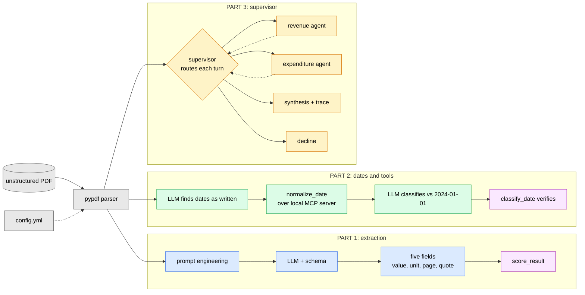

# Developing a multi-agent analyzer and document extractor

Extracting structured information from an unstructured document - the Singapore
MOF *Analysis of Revenue and Expenditure FY2024* - in three parts:

* Document extraction and prompting via LangChain
* Tool calling via a local MCP server
* Multi-agent supervisor via the LangGraph framework

## Contents

| Section | |
|---|---|
| [The three parts](#the-three-parts) | How the pieces fit together |
| [Instructions to implement](#instructions-to-implement) | Install, run each part, read the saved results |
| [Layout](#layout) | What lives where |
| [Part 1: extraction](#part-1-extraction) | Five fields from their cited pages |
| [Part 2: dates and tools](#part-2-dates-and-tools) | Dates normalised over MCP, classified by the LLM |
| [Part 3: multi-agent supervisor](#part-3-multi-agent-supervisor) | Two specialists, one supervisor, a full trace |
| [Part 4: Results](#results) | All three parts, all seven queries |
| [Part 5: Limitations](#limitations) | Limitations | 
| [Part 6: Future work](#future-work) | Future work | 

## The three parts



## Instructions to implement

```bash
uv sync
cp .env.example .env          # add GROQ_API_KEY (free, no card)

uv run pytest                 # 236 tests, no key or network needed
uv run ruff check .

# Part 1 - extraction
uv run python -m src.extraction.extractor      # five fields, scored

# Part 2 - dates and tools
uv run python -m src.extraction.dates          # dates found and normalised
uv run python -m src.extraction.date_reasoning # classified vs 2024-01-01, checked

# Part 3 - supervisor
uv run python -m src.graph.workflow            # the required query, with trace
```

The source PDF is downloaded from the URL in `config.yml` on first use and
cached in `data/`, which is gitignored - a fresh clone needs only the config.

Each part also writes its answer to `results/`, which is committed, so every
output below can be read without running anything or spending API budget:

| File | Written by | Holds |
|---|---|---|
| `results/extraction.json` | `src.extraction.extractor` | The five fields, each with value, unit, page and quote |
| `results/dates.json` | `src.extraction.date_reasoning` | Both dates, normalised and classified, with the model's reasoning |
| `results/supervisor.json` | `src.graph.workflow` | The full trace: decisions, findings, citations, answer and node costs |


## Layout

```
config.yml        # pdf url, page bindings, model, agent pages, reference date
.env              # GROQ_API_KEY (gitignored; see .env.example)
prompts/          # prompts for LLM and agents
expectations/     # known-correct values and the Part 3 query set
results/          # each part's answer, committed so it can be read
src/
  config.py       # config.yml + .env -> one settings object
  llm.py          # LLM for all parts
  evaluation.py   # Check/Report scoring for parts 1 and 2
  results.py      # save_json(): each part's answer -> results/
  ingestion/      # fetch the PDF, extract pages with --- page N --- markers
  extraction/     # parts 1 and 2: schemas, prompts, extraction, dates
  tools/          # part 2: the date tools, and the MCP server and client
  agents/         # part 3: the supervisor and the two specialists
  graph/          # part 3: state, the graph, the trace, and evaluation for part 3
tests/            # 236 tests; model stubbed, no network
```


## Part 1: extraction

Part 1 involves extracting five fields from their cited pages. As seen below, the fields consist different data types such as floats and list of strings.

| Field | Value | Unit | Page | Note |
|---|---|---|---|---|
| Corporate Income Tax | 28.4 | billion | 5 | Prose: stated in a sentence, so context disambiguates it |
| Year-on-year change | 17.0 | % | 5 | Prose: same sentence as the amount, stated not calculated |
| Total top-ups | 20,352 | million | 20 | **Table row**: a "Total" line under a ($ million) heading |
| Taxes in Operating Revenue | 7 names | - | 5-6 | Prose: names spread across several paragraphs |
| Overall Fiscal Position | -3.57 | billion | 8 | **Table row** : one figure per year column, with negative value in parentheses |

Two of the five are of table rows, which is a core criterion in choosing the most appropriate parser, as shown below. 

### 1.0 LLM and provider

The LLM used for extraction `llama-3.1-8b-instant`, served through Groq, at `temperature: 0`. All settings can be found in `config.yml`.

| Why Groq | |
|---|---|
| Free, no card | The constraint that excluded GPT-4 and Claude on cost, not merit |
| Nothing downloaded | Ollama needs 2-5 GB of disk and RAM per model |
| Structured output | Supports Pydantic schemas; `langchain-huggingface` raises `NotImplementedError` |
| Correct values | A local model returned `28400000000.0`, folding the unit into the value |
| The trade | 100k tokens/day - which is why answers are committed to `results/` rather than regenerated |

**Consideration 1: Temperature 0 is what makes prompt iteration measurable.** The model takes
the most likely token each time, so the same pages yield the same figures, and
a changed result can be attributed to the prompt rather than to sampling. To make it reproducible, temperature 0 is used.

### 1.1 Parser: pypdf

**Consideration: Page is used as the parsing unit.** Each target field is identified by the page
it appears on - "page 5", "page 20" - so pages are chosen as the natural unit, and [`extract_pages()`](src/ingestion/parser.py) returns only those
requested, each prefixed with a `--- page N ---` marker. Those markers are what
make the page binding enforceable: the prompt can say PAGE 5 ONLY because the
model can see where page 5 ends.

Chunking by paragraph or token count would break that, leaving one
undifferentiated block with no way to tell which page a figure came from.

Five parsers were considered: `pypdf`, `PyMuPDF`, `pdfplumber`, `Docling` and `OCR`. The latter two parsers were ruled out on inspection as Docling's ML layout analysis solves a problem a born-digital PDF does not have, and OCR needs raster images, of which this document has none. The remaining three were measured through **row integrity** and **latency**.

> **Row integrity** means the table row survives extraction as one line - the
> label still attached to its figures. The Corporate Income Tax row on page 8
> reads `Corporate Income Tax 23.07 24.26 28.38 23.0 17.0` in the document.

What each parser returns for that row (from initial assessment):

| Parser | Text Output for the Corporate Income Tax row | Result |
|---|---|:---:|
| `pypdf` | `Corporate Income Tax 23.07 24.26 28.38 23.0 17.0` | Pass |
| `pdfplumber` | `Corporate Income Tax 23.07 24.26 28.38 23.0 17.0` | Pass |
| `PyMuPDF` | `Corporate Income Tax` - figures detached | **Fail** |

In addition, **latency** is also considered as a secondary criterion to ensure that the information can be parsed fast to facilitate a more efficient extraction. 

| Parser | Row integrity | Speed (4 pp.) | Verdict |
|---|:---:|---:|---|
| **pypdf** | Pass | 450 ms | **Chosen** - correct, and the faster of the two |
| pdfplumber | Pass | 823 ms | Rejected - correct but 1.8x slower |
| PyMuPDF | **Fail** | 52 ms | Rejected - fastest, but wrong |
| Docling | not tested | - | Ruled out - no scanned pages |
| OCR | not tested | - | Ruled out - zero raster images |

**Correctness decides; speed only breaks ties.** Based on both criteria, `pypdf` is chosen as the parser due to its accuracy in parsing the table content and is 1.8x faster than `pdfplumber`.


### 1.1a Extracting structured information

Once the pages are parsed, the schema decides what shape the answer comes back in. It is what makes the output structured rather than prose: without it the
model returns a sentence that has to be parsed afterwards, and parsing free
text is where a wrong figure slips through unnoticed.

The five fields are Pydantic models in `src/extraction/schemas.py`, bound to
the model with `with_structured_output(ExtractionResult)`. The model fills the
schema rather than writing an answer, so the output is typed before any code
touches it.

| In the schema | Why |
|---|---|
| `value: float` | A figure arrives as a number, so `28.4` cannot come back as "about $28 billion" |
| `unit: Literal["million", "billion"]` | Units are recorded as the page states them, never converted - p.20 says $million and everything else says $billion, and silently normalising would hide a mismatch |
| `page: int = Field(gt=0)` | Every value carries where it was read from |
| `quote: str` | The verbatim text it was read from, with a validator rejecting a blank one |

The last two are what make the answer checkable. This is so as terms such as "Corporate Income Tax" appear
on multiple pages with different values, so a bare number cannot be verified - the
page and quote let a reader confirm the model read the intended row.

The schema also rejects bad output instead of passing it on. A missing field, a page number of 0, a unit that is not million or billion, or an empty quote all raise an error rather than returning something that looks fine. This ensures that the LLM extracts the right number with an appropriate text citation. 

### 1.2 Prompt engineering
The next part of the task involves extracting the relevant information through prompt engineering in Large Language Model (LLM).
The prompt template can be found at `prompts/extraction.yaml`, which is a configurable file that is separated from the core architecture. Users can first fill in the page numbers and document text to be queried at `config.yml`, where the configurations will be adapted into the prompt template. The prompt template can also be edited. 

Configurations that are filled in `config.yml` 

| Filled in | From | Reaches the prompt as |
|---|---|---|
| Which page each field is bound to | `field_pages` in `config.yml`, via `page_variables()` | `{page_cit}`, `{page_top_ups}` - one placeholder per field |
| The text of those pages | `extract_pages()`, each page prefixed `--- page N ---` | `{page_text}` |

> Note: both the page number and the markers must be present. A page number
> binds nothing if the model cannot see where that page starts, and the markers
> bind nothing if the prompt never names a page.


**Consideration 1: Guardrails in the extraction prompt.** It is important to ensure that the LLM is grounded with the extraction with no hallucination of the extraction of numerical data. As such, the following areas are included as guardrails in the prompt 

| Guardrail | Wording | Closes |
|---|---|---|
| Scope binding | "PAGE 5 ONLY", one page named per field | A right value read from a page the field was never bound to |
| Copy, do not compute | "Do NOT calculate anything. Not a difference, not a percentage, not a sum" | A derived figure that is arithmetically sound and appears nowhere in the document |
| No prior knowledge | "Do NOT use prior knowledge of Singapore budgets" | The model answering from training rather than from the text supplied |
| Cite or omit | "If you are about to write a number, first find it verbatim in the text. If you cannot point to it, you must not write it" | An uncheckable number - every field carries the page and quote it came from |

**Consideration 3: Additional constraints.** Additional constraints attached to the page that the LLM governs.

1. **Binding.** The value must come from the cited page and nowhere else -
   "Corporate Income Tax is on page 5" is a suggestion, "PAGE 5 ONLY" is a
   limit. The prompt also names the trap: the top-ups total appears on p.8 as
   24.32 billion, so it says to take p.20's 20,352 million rather than the
   first plausible match.
2. **Scoped.** A general preference - *prefer prose over tables* - applies only
   on the cited page. Left general it competes with the citation instead of
   sitting under it, and returns p.5's prose (-3.6) where the fiscal position
   is p.8's table figure (-3.57).
3. **Withheld.** The tax list is constrained to prose on the cited pages, but
   the expected count is deliberately left out. Stating it would hand the model
   the answer, and a scorer cannot check an answer the prompt supplied - here
   being more specific meant leaving a detail out.

### 1.3 Assumptions

**Only the cited pages are read.** A correctness measure, not an optimisation.For instance, "Corporate Income Tax" appears eight times across seven pages:

| Page | Value | What it is |
|---|---|---|
| 5 | **28.4** | Revised FY2023, prose - the answer |
| 8 | 28.38 | same figure, table precision |
| 8 | 23.07 / 24.26 | FY2022 actual / FY2023 estimated |
| 9 | 27.2% | share of Operating Revenue |
| 16 | 28.03 | Estimated FY2024 |
| 26 | 28,380 / 28,029 | same figures in $million |
| 27 | 3.9% | share of GDP |

Restricting the input eliminates seven wrong answers before the
model reads anything.

**The tax list counts revenue lines, not their constituents.** Pages 5-6 name
seven taxes as Operating Revenue components. Four more appear inside the
description of one of them - "Other Taxes, which include the Foreign Worker
Levy, Water Conservation Tax, Land Betterment Charge, and Annual Tonnage Tax"
(p.5) - and are not counted separately, since the document presents them as
what Other Taxes consists of rather than as revenue lines in their own right.


## Part 2: dates and tools

Part 2 extends from part 1 by including MCP tools and LLM reasoning. In this part, date related information from two fields are extracted, normalized into ISO format through MCP tool and LLM is used for reasoning by comparing against a reference date `2024-01-01`. The comparison and fields are shown below

| Status | Means | For a single date | For a period |
|---|---|---|---|
| Expired | Already passed | Falls before the reference | Its end falls before the reference |
| Upcoming | Still to come | Falls after the reference | Its start falls after the reference |
| Ongoing | A period currently active | Only when it *is* the reference - a point has no span to be inside | The reference falls within it, inclusive |

| Field | Page | Normalised | Status vs 2024-01-01 |
|---|---|---|---|
| Distribution | 1 | 2024-02-16 | Upcoming |
| Estate Duty | 36 | 2008-02-15 | Expired |

### 2.1 How the dates are extracted

| # | Step | Who | What happens |
|---|---|---|---|
| 1 | Select pages | code | `date_pages` binds each date to a page - 1 and 36 - and `extract_pages()` returns only those |
| 2 | Extracts date | model | Fills `DocumentDates`: the sentence verbatim, the date **exactly as written**, and the page |
| 3 | Normalise | tool | [`normalize_date`](src/tools/date_tool.py) turns "16 February 2024" into `2024-02-16`, called over the local MCP server |
| 4 | Classify | model | LLM classifies extracted data against `reference_date` into Expired / Upcoming / Ongoing |
| 5 | Verify | tool | `classify_date` (deterministic Python tool) recomputes the status and flags any disagreement |

**Only step 3 crosses the MCP protocol,** and `normalize_date` is the only tool
the server exposes. It runs over the server as a subprocess, with the
in-process `@tool` as a fallback; `main` reports which route it used.

Built with **FastMCP**, where `@mcp.tool()` builds a tool's schema from its
signature and docstring. Transport is **stdio**: `mcp_client` runs
[`mcp_server`](src/tools/mcp_server.py) as a subprocess, sending requests to its
stdin and reading replies from its stdout, which is why nothing in the server
prints.


The answer is written to `results/dates.json`:

```json
[
  {
    "original_text": "Distributed on Budget Day: 16 February 2024",
    "normalized_date": "2024-02-16",
    "status": "Upcoming",
    "reasoning": "2024-02-16 is after 2024-01-01"
  },
  {
    "original_text": "Estate Duty does not apply to a person who dies after 15 February 2008.",
    "normalized_date": "2008-02-15",
    "status": "Expired",
    "reasoning": "2008-02-15 is before 2024-01-01"
  }
]
```

`reasoning` is used to record the comparison the model made, so the status can be
audited rather than taken on trust. Without it, a wrong classification looks
exactly like a right one.


**Consideration 1: the LLM is grounded in the document's own words.** The model
never converts a date and the tool never interprets one. Step 2 hands over the
wording as the document writes it, so `normalize_date` parses that rather than
the model's idea of it - a full `strptime` match first, then a regex to pull a
date out of a longer sentence. Anything unparseable returns `None`, never a
guess.

**Consideration 2: a failure is surfaced, not absorbed.** Both dates are stated
plainly on their cited pages, so no retry or fallback search runs if the model
misses one. A missing date fails schema validation; a date `normalize_date`
cannot parse is reported as skipped rather than classified.

### 2.2 Assumptions

**Dates are explicit calendar dates.** Open-ended expressions - "till present",
"with immediate effect" - are out of scope; `normalize_date` returns None
rather than inventing a boundary.

**Dates are written in full.** The document spells them out - "16 February
2024" - as a government publication does, so that is the format the tool is
built for. Three further shapes are accepted due to the needs of the document which are:

| Shape | Example | |
|---|---|---|
| Day month year | 16 February 2024 | The document's own form |
| Month day, year | February 16, 2024 | Accepted |
| ISO | 2024-02-16 | Accepted |
| Slashed, day first | 16/02/2024 | Accepted, read day first - a US-style 02/16/2024 is misread rather than rejected |
| Abbreviated month | 16 Feb 2024 | Accepted |
| Ordinals, partial or non-English dates | 16th February 2024; "2024"; "16 Février" | Not parsed |


## Part 3: multi-agent supervisor

Part 3 focuses on handling complex queries such as *"What are the key revenue streams, and how will
the Future Energy Fund be supported?"*, where the question spans across two subjects sitting on different
pages.

A multi-agent system is built using a Langgaraph architecture which consists of a supervisor that routes and two
specialist agents (revenue agent and expenditure agent) each bound to their own pages. There are also two terminal nodes, which are
synthesis, which writes the answer, and decline, for a query the document
cannot address.

A run of the query above generally takes three turns:

| Turn | Potential routes | Definition |
|---|---|---|
| 1 | `revenue_agent` | Specialises in identifying and extracting information on revenue, from pp. 9, 13, 15 |
| 2 | `expenditure_agent` | Specialises in finding and analysing information on government spending, from pp. 16, 18, 20 |
| 3 | `synthesis` | Writes the answer from the two findings, citing the figures each agent reported |

> Note 1: a query covering one subject only takes two turns - one agent, then
> synthesis. The turn count follows from how many subjects the question spans,
> but synthesis always runs, since it is what turns findings into an answer.

> Note 2: six pages covering the information the query needs are fixed in
> `config.yml`, three per agent. Narrowing what each agent can see is what keeps
> a plausible figure from the wrong page out of reach.


**How routing works**

**Reasoning** Every turn, including
after an agent has reported, the model is given the query, which agents have
already been consulted, their summaries so far, and the page ranges each agent
covers. It returns a `RouteDecision`: a stated rationale, the chosen route, and
the sub-task for that agent. `reasoning` is declared before `next` in the
schema, so the justification is produced before the choice rather than fitted
to it afterwards.

**Deterministic check through a guard.** The model's answer is not routed
directly. `route()` in [supervisor.py](src/agents/supervisor.py) screens it in
plain Python - a list membership test and an integer comparison, no model
involved - so the graph terminates, never answers from nothing, and never
discards what it gathered:

| Condition | Forces |
|---|---|
| The chosen agent has already reported | `synthesis` |
| `max_turns` reached | `synthesis` |
| `synthesis` chosen with no findings | An agent, so there is something to synthesise |
| `out_of_scope` chosen with findings present | `synthesis` |

When it fires, the trace keeps both the choice and the override, so a forced route never reads as the model's decision. 

### 3.2 Inside one agent turn

What an agent does with a sub-task, taken from the saved run in
`results/supervisor.json`. The supervisor routed to `revenue_agent` with the
sub-task *"list the key government revenue streams"*:

| Step | What happens |
|---|---|
| 1 | [`extract_pages()`](src/ingestion/parser.py) loads specific pages for a specific scope, pp. 9, 13, 15 only, each prefixed `--- page N ---` |
| 2 | The page text and the sub-task fill the agent's prompt - the document never enters graph state |
| 3 | The model returns an `AgentReport`: a prose summary plus a list of figures, each with value, unit, page and the quote it was read from |
| 4 | [`page_of_quote`](src/ingestion/parser.py) resets each figure's page to the marker section its quote actually falls under |
| 5 | The report becomes a `Finding`, tagged with the agent's name and the pages it read, and appended to state |

It returned five figures:

```
Corporate Income Tax                  27.2 percent   p.9
Personal Income Tax                   16.8 percent   p.9
Goods and Services Tax                15.7 percent   p.9
Estimated FY2024 Operating Revenue   108.6 billion   p.13
Estimated FY2024 NIRC                 23.5 billion   p.15
```

The finding returns to the supervisor, not to the other agent - each agent sees
only its own pages and its own sub-task. The supervisor then decides who works
next and writes their brief: here it routed to the expenditure agent for the
second part of the query, which repeats the same five steps over pp. 16, 18, 20.

Step 4 earns its place in that sequence. The model recorded NIRC as p.13 while
quoting p.15's sentence, and both pages state the figure - so the value gives no
sign anything is wrong. Only the quote does, and since it must be verbatim, the
page follows from it.

### 3.3 Demo queries
The agentic system is tested on 7 queries, covering a wide variety of queries

| Query type | Agents invoked |
|---|---|:---:|
| Revenue only | revenue | 
| Expenditure only | expenditure | 
| Both - revenue streams and the Future Energy Fund | revenue, expenditure |
| Out of scope | none - declined | 

Queries are be configured in `expectations/demo_queries.yaml`

**Consideration 1: Choice of specific multiple pages.** The six pages are
shortlisted from the query and fixed in `config.yml`. It spans across revenue and expenditure, which sit in
different sections, and each subject then spans pages of its own such as the total,
its composition and the supporting detail are all stated separately.

| Agent | Pages | What is on them |
|---|---|---|
| `revenue_agent` | 9, 13, 15 | Revenue breakdown, the FY2024 narrative, NIRC |
| `expenditure_agent` | 16, 18, 20 | Table 2.1, the top-ups prose, Table 2.4 |

As the information is disjoint and spans pages, the split into a narrow range is also what
gives each agent a subject it can answer and the other cannot.

> Note: page 13 carries both the revenue total and the top-ups sentence, and is
> assigned to `revenue_agent` alone. That keeps the combined query out of reach
> of either agent on its own.

**Consideration 2: Restricting the input is a correctness measure** rather than
an optimisation. Several target terms recur across the document with different
values as seen in part 1, so an agent granted the full text will surface a figure that is
plausible in isolation and wrong in context - with nothing in the value itself
to indicate which.

Fixing the page sets in configuration, rather than letting an agent retrieve
what it judges relevant, is also what makes the citations checkable:
`check_page_discipline` compares every cited page against the agent's
configured set, and a figure from outside it was never read. Under retrieval any
page would be legitimate, so the check would have nothing to assert.


### 3.4 Evaluation

As the generated answer is free text, there is no single correct wording to
score it against. Five deterministic checks, written in Python rather than
judged by a model, are applied to the run instead. Each is binary (pass or fail), and a query
passes only when all five do.

| Check | Catches | Compared against |
|---|---|---|
| Routing | An agent that should have run and did not, or one that ran needlessly | Expected agents in `demo_queries.yaml` |
| Figures | A wrong value, or the right value with the wrong unit | Required values in `demo_queries.yaml`, within a 0.005 tolerance |
| Traceability | A quote that does not appear on the page it cites | The text of the page it cites |
| Page discipline | A figure from a page the agent was never given | The agent's page set in `config.yml` |
| Labels | A figure renamed on its way into the answer | The label the finding gave it |

> Note: the last three compare against the document, the configuration and the
> findings rather than declared expectations, so they hold for any query.

### 3.5 Assumptions

**Each agent runs at most once per query.** One pass over an agent's pages is
assumed to be enough, which keeps the graph provably terminating and the cost
bounded at one model call per agent. What is given up is a second call under a
*different* sub-task, which might surface something the first was not asked for.

**Each query is answered from scratch, with no LangGraph memory.** Out of scope
here: every query is self-contained, so no checkpointer and no `thread_id`.
`SupervisorState` carries findings and decisions between nodes within one run
and is discarded when it returns - short-term state, not memory. Persisting it
would break the guard, which reads `visited` as "who has reported on this
query".

## Results

Saved to `results/` by each part's `main()`, so the output can be read without
re-running anything.

| Part | Result | Detail |
|---|---|---|
| 1 - extraction | Pass | 5/5 fields correct on value, unit and page |
| 2 - dates | Pass | 2/2 normalised and classified correctly |
| 3 - supervisor | Pass | 5/5 on the required query |

In addition, for part 3, all seven demo queries were run against the current build:

| Query | Checks | Agents invoked | Notes |
|---|---|---|---|
| `revenue_only` | 5/5 | revenue | Two turns |
| `expenditure_only` | 5/5 | expenditure | Two turns |
| `required` | 5/5 | revenue, expenditure | Three turns |
| `collaboration` | 5/5 | expenditure, revenue | Three turns |
| `nirc_classification` | 4/5 | revenue, expenditure | Additional routing to expenditure was conducted, though not needed |
| `out_of_scope_sensible` | Declined | none | Correct |
| `out_of_scope_nonsense` | Declined | none | Correct |

Every citation verifies against the page it cites, and every figure keeps the
label its finding gave it. The single failing check is routing, where an
unnecessary agent cost a turn but not the answer - recorded under Known
limitations.

### Trace: the required query

The decision trace records the
supervisor's process rather than a log of which functions ran, which takes four
things: why it routed there (`reasoning`, stated before the choice), that it
*was* a choice (`chose` alongside `routed_to`), when the system overruled it
(`overridden`, naming the condition), and what each agent contributed (one
`Finding` each, with its pages and figures). A fixed chain would answer this
query too and have no decisions in it to trace.

`Trace.render()` prints six blocks. The shape, with values elided:

```
QUERY: <the question asked>

SUPERVISOR DECISIONS
turn  chose              routed to          why
--------------------------------------------------------------------------------
1     <route>            <route>            <the model's stated reasoning>
2     <route>            <route>            <the model's stated reasoning>
3     <route>            <route>            <the model's stated reasoning>
                         OVERRIDDEN:        <which condition fired, where they differ>

AGENT FINDINGS
agent                pages            figures
<agent>              <pages read>     <count>

CITATIONS
      <value> <unit>  p.<n>  <label>
                             "<the sentence it was read from>"

ANSWER
<the synthesised prose, citing a page for every figure>

NODE COSTS
node                   seconds
<node>                 <time>
------------------------------
total                  <time>

<n> decisions, <n> agents invoked, <n> overrides, <n> figures cited
```

Together these show not just the answer but how it was reached: which routes
were taken and why, where the guard overruled the model, what each agent
contributed, and which sentence in the document every number came from. The
filled-in record for the required query is in `results/supervisor.json`.

## Assumptions that hold across all three parts

**Part 3 uses JSON mode rather than tool-calling.** The supervisor and both
agents pass `method="json_mode"`; Parts 1 and 2 use LangChain's default, which
is tool-calling. The difference is generation length. Part 3 asks for a stated
rationale before the choice, and over that length the tool-call wrapper drifts
from the format Groq's parser accepts, which leads to the request being rejected even when the
content is correct. Parts 1 and 2 emit short structured objects and never hit
it, so they are left on the default rather than changed for symmetry.

**The model quotes accurately but may cite the wrong page.** It is assumed to be
grounded in the text it was given, so the quotes it returns are verbatim. The
page attached to them is less reliable as related figures appear on several
pages, and the model can read one and record another.
[`page_of_quote`](src/ingestion/parser.py) replaces the model's page with the
one whose text contains the quote. Where no match is found, the model's page is
kept and the traceability check reports it.

## Limitations

* Pages and target content must be defined up front to ensure that the LLM/agent is extracting the right data due to variations of data. This may not be feasible if future requests focus on specific topics without knowledge of pages 
* Routing is inconsistent between runs. As the routing logic is highly dependent on the supervisor agent, the same query can take a different path each time. Temperature 0 removes sampling, not server-side variation
* For this task, the reasoning in synthesis is not verified, as the focus is the accuracy of the extraction and the generated output. The labels check catches a figure renamed on its way into the answer, but an inference drawn from correct figures can still be wrong and pass every check - human review is what closes that gap
* Extraction and implementation is still very specific and dependent towards the source data
* The model's raw output is corrected before it is recorded - `page_of_quote` resolves a figure's page from its quote, and the synthesis prompt supplies the labels to reuse. Both are deliberate, but they mean the trace shows the corrected result rather than what the model first produced. How far the two diverge would be worth studying, but it is not the focus of this task and was not pursued

## Future work

* Retrieval over the whole document by removing hand-picked page sets and the document-specific schemas
* Persist results and traces onto a database rather than stored in local directory
* Extend scalability and adaptability of the solution into other documents
