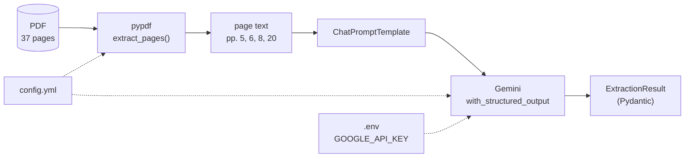

# structural-extanalyzer

Structured extraction from the Singapore MOF *Analysis of Revenue and
Expenditure FY2024*, using LangChain prompting, tool calling, and a LangGraph
multi-agent supervisor.

## Pipeline



No database and no vector store: the spec cites the pages holding each field, so
retrieval is already solved. The LLM reads the supplied text and copies values
into typed fields — it does not compute or recall.

## Assumptions

**Only the pages cited by the spec are read** (5, 6, 8, 20), configured in
`config.yml`. This is a correctness measure rather than an optimisation.
"Corporate Income Tax" appears on pages 5, 8, 9, 16, 26, 27 and 37 with a
different value each time:

| Page | Value | Meaning |
|---|---|---|
| 5, 8 | 28.38 | Revised FY2023 ($bn) |
| 16 | 28.03 | Estimated FY2024 ($bn) |
| 9 | 27.2% | share of Operating Revenue |
| 26 | 23,072 | FY2022 actual ($m) |

Passing the whole document would leave the model choosing among seven plausible
candidates. Restricting the input removes that ambiguity.

**Page numbers hold for this edition only.** A revised document with different
pagination needs `config.yml` updated. Locating pages by content would be more
robust, but is unnecessary when the spec supplies the citations.

**Target year is FY2023.** The spec labels the fields "2024" but cites pages 5
and 8, which contain Revised FY2023 data — the true FY2024 estimates are on
pages 13-16. The page citations were taken as authoritative.

**The parser verdict is document-specific.** See
`notebooks/00_parser_comparison.ipynb`. Re-run it for any new source.

## Parser choice

`pypdf`, selected on measured output rather than reputation. Full evidence in
`notebooks/00_parser_comparison.ipynb`.

| Parser | Row integrity (p.8) | Speed (4 pp.) | Verdict |
|---|---|---:|---|
| **pypdf** | Pass | 450 ms | **Chosen** |
| PyMuPDF | Fail - label separated from its figures | 52 ms | Rejected |
| pdfplumber | Pass - identical text | 823 ms | Rejected |
| Docling | - | - | Rejected - no scanned pages to interpret |
| OCR | - | - | N/A - zero raster images |

Three of the five fields are read from Table 1.1 on page 8, so a figure is only
useful if it stays bound to its label. pypdf and pdfplumber return
`Corporate Income Tax 23.07 24.26 28.38 23.0 17.0` intact; PyMuPDF returns the
bare label with every figure detached, and fails all four labels tested. On page
5 prose all three agree, so the failure is table-specific. pypdf is the faster
of the two correct parsers.

PyMuPDF is usually recommended as the fastest default. That ranking inverts here
- speed is only a tiebreak among parsers that are already correct.

### Known limitations

- **pypdf reads table content, not table structure.** `28.38` arrives on the
  right line but carries no marker placing it in the *Revised FY2023* column;
  the prompt must bind it via the header. No fallback parser helps -
  pdfplumber's `extract_tables()` also returns nothing on this page.
- **Chart values are drawn as shapes, not stored as data,** so no parser or OCR
  recovers them. Read the corresponding table instead.

## Setup

```bash
uv sync
cp .env.example .env    # then add your GOOGLE_API_KEY
```

`data/` is gitignored: place the source PDF there at the path named in
`config.yml`.

## Layout

```
config.yml                     # pdf path, target pages, model name
.env                           # GOOGLE_API_KEY (gitignored)
src/
  config.py                    # load_dotenv() + yaml.safe_load()
  ingestion/parser.py          # pypdf text extraction
  extraction/
    schemas.py                 # Pydantic models
    prompts.py                 # prompt templates
    extractor.py               # prompt | with_structured_output
notebooks/
  00_parser_comparison.ipynb   # parser selection, with evidence
tests/                         # pytest; no network, no API key, no data/
```

## Tests

```bash
uv run pytest
```

Tests mock the LLM and build fixture PDFs in-process, so the suite runs without
an API key, network access, or the source document.
