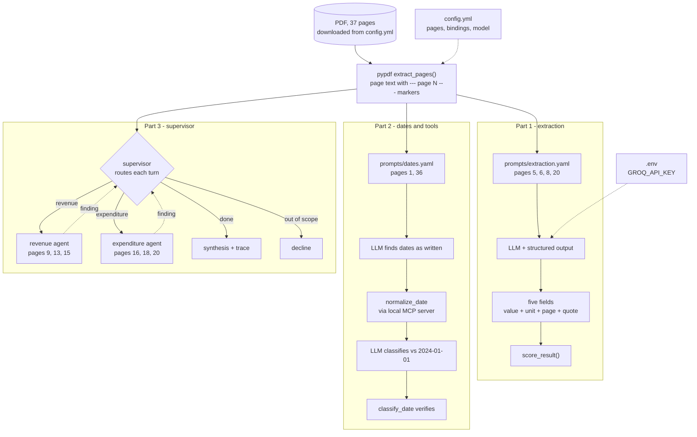

# structural-extanalyzer

Structured extraction from the Singapore MOF *Analysis of Revenue and
Expenditure FY2024*, in three parts: LangChain prompting, tool calling via a
local MCP server, and a LangGraph multi-agent supervisor.

## The three parts



No database and no vector store: the page holding each answer is known, so
retrieval is already solved. The model reads the supplied text and copies
values into typed fields - it does not compute or recall.

## Quick start

```bash
uv sync
cp .env.example .env          # add GROQ_API_KEY (free, no card)

uv run pytest                 # 183 tests, no key or network needed
uv run ruff check .

# Part 1 - extraction
uv run python -m src.extraction.extractor      # five fields, scored

# Part 2 - dates and tools
uv run python -m src.extraction.dates          # dates found and normalised
uv run python -m src.extraction.date_reasoning # classified vs 2024-01-01, checked
uv run python -m src.tools.mcp_client          # smoke check: list the MCP server's tools

# Part 3 - supervisor
uv run python -m src.graph.workflow            # the required query, with trace
```

The source PDF is downloaded from the URL in `config.yml` on first use and
cached in `data/`, which is gitignored - a fresh clone needs only the config.

Notebooks carry the evidence for each decision:

| Notebook | Shows |
|---|---|
| `00_parser_comparison.ipynb` | Why pypdf, measured against PyMuPDF and pdfplumber |
| `01_value_exploration.ipynb` | What the correct answers are, derived from the document |
| `02_extraction.ipynb` | Model selection and two prompt versions, scored |
| `03_dates.ipynb` | MCP server, normalisation, classification with a check |
| `04_supervisor.ipynb` | The graph, seven demo queries, and the decision trace |

## Part 1: extraction

All five fields extract correctly from their cited pages.

| Field | Value | Unit | Page |
|---|---|---|---|
| Corporate Income Tax | 28.4 | billion | 5 |
| Year-on-year change | 17.0 | % | 5 |
| Total top-ups | 20,352 | million | 20 |
| Taxes in Operating Revenue | 7 names | - | 5-6 |
| Overall Fiscal Position | -3.57 | billion | 8 |

### Parser: pypdf

Measured in `00_parser_comparison.ipynb`. Three of the five fields are read
from the table on page 8, so a figure is only useful if it stays bound to its
label.

| Parser | Row integrity (p.8) | Speed (4 pp.) | Verdict |
|---|---|---:|---|
| **pypdf** | Pass | 450 ms | **Chosen** |
| PyMuPDF | Fail - label separated from figures | 52 ms | Rejected |
| pdfplumber | Pass - identical text | 823 ms | Rejected - slower, no upside |
| Docling | - | - | Rejected - no scanned pages |
| OCR | - | - | N/A - zero raster images |

PyMuPDF is usually recommended as the fastest default. That inverts here:
speed is only a tiebreak among parsers that are already correct.

`pdfplumber.extract_tables()` returns 0 tables on page 8 - the table has no
ruling lines and detection is line-based - so no parser yields a cell grid.

### Prompt engineering

The first prompt got three of five fields right. It named the correct page for
every field and still read the wrong one twice, because it treated the page
citations as preferences rather than constraints. Both versions are kept
(`prompts/extraction.yaml` and `extraction_v1.yaml`) and run side by side in
the notebook.

Wording proved load-bearing: changing "read both pages to the end" to "read
those pages to the end" changed which taxes were returned, reproducibly at
temperature 0.

## Part 2: dates and tools

| Date | Page | Normalised | Status vs 2024-01-01 |
|---|---|---|---|
| Distribution | 1 | 2024-02-16 | Upcoming |
| Estate Duty | 36 | 2008-02-15 | Expired |

The split is deliberate: the model finds dates in prose because phrasing
varies, and a tool parses them because that has one right answer. The
requirement asks for LLM *reasoning* on the classification, so the model
decides and `classify_date` verifies afterwards - detection rather than
prevention, since prevention would mean not asking the model at all.

`src/tools/mcp_server.py` exposes both tools over stdio and is what the
pipeline uses. The `@tool` decorators remain as an automatic fallback; both
share one implementation, so the server is a transport rather than a second
copy.

## Part 3: multi-agent supervisor

Agents route unconditionally back to the supervisor, which is the only node
that decides. A fixed chain would have no decision to trace, and the trace is
what the requirement asks for.

**Seven demo queries, seven correct routes** - single-agent both ways, two
agents collaborating, and two queries declined without invoking either.
Queries live in `evaluation/demo_queries.yaml` so one can be added or disabled
without touching code.

**Page 13 is scoped to revenue only, deliberately.** It carries both the
revenue total and the top-ups sentence, so keeping it out of the expenditure
set means neither agent can answer the combined query alone. The collaboration
is structural, and asserted in the tests.

**The supervisor's choice is guarded.** Three deterministic rules - no agent
twice, a turn cap, no synthesis before any finding - and each records itself in
the trace when it fires, so a forced route is never presented as a decision.

### Scoring an open-ended answer

Prose has no single correct wording, so it is not scored. Four things are:

| Check | Catches |
|---|---|
| Routing | An agent that should have run and did not, or one that ran needlessly |
| Figures | A wrong value, or the right value with the wrong unit |
| Traceability | A quote that does not appear on the page it cites |
| Page discipline | A figure from a page the agent was never given |

## Assumptions

**Only the cited pages are read.** A correctness measure, not an optimisation.
"Corporate Income Tax" appears eight times across seven pages:

| Page | Value | What it is |
|---|---|---|
| 5 | **28.4** | Revised FY2023, prose - the answer |
| 8 | 28.38 | same figure, table precision |
| 8 | 23.07 / 24.26 | FY2022 actual / FY2023 estimated |
| 9 | 27.2% | share of Operating Revenue |
| 16 | 28.03 | Estimated FY2024 |
| 26 | 28,380 / 28,029 | same figures in $million |
| 27 | 3.9% | share of GDP |

All plausible. They differ by year, unit and kind, and nothing in the number
says which. Restricting the input eliminates seven wrong answers before the
model reads anything.

**Each field is read from the page cited for it,** not from wherever the figure
is most precise. Page 5 says "$28.4 billion"; page 8's table says 28.38. The
citation decides.

**Units are recorded, not converted.** Page 20 states $million while the other
pages state $billion. Normalising would hide a 1000x error.

**Target year is Revised FY2023,** except top-ups, which page 20 states for
FY2024. That follows from the page citations rather than a consistent year
choice, so no single target year is correct for all five fields.

**"Latest Actual Fiscal Position" is read as the latest available figure** —
the Revised FY2023 deficit, -3.57. Table 1.1's strictly *Actual* column is
FY2022 (1.72, a surplus); that reading would break with every other field,
which the spec labels 2024 and the cited pages state as FY2023. The rejected
alternative is noted here rather than silently dropped.

**Dates are explicit calendar dates.** Open-ended expressions - "till present",
"with immediate effect" - are out of scope; `normalize_date` returns None
rather than inventing a boundary.

**The reference date is fixed at 2024-01-01,** not today, so results stay
stable over time.

**The document does not identify a revenue stream funding the Future Energy
Fund,** and the answer says so. Government revenue is not earmarked to
particular funds; naming one would be wrong however fluent.

**Structured output uses JSON mode rather than tool-calling.** Over a long
generation the tool-call wrapper drifts from the format Groq's parser accepts,
and the request is rejected even when the content is correct. JSON mode also
works across model families where tool-calling support varies.

**Temperature is 0** throughout, so the same input yields the same output.

**Everything is document-specific.** The parser verdict, page citations, unit
conventions and the two-fiscal-year structure are particular to this
publication. Re-run the notebooks for any new source.

## Model and provider

`llama-3.1-8b-instant` on Groq, used by every part. Constraint: free tier, no
card - GPT-4 and Claude are excluded on cost, not merit.

| | Ollama (local) | Groq | Gemini |
|---|---|---|---|
| Disk / RAM | 2.0-5.2 GB / 2.5-5.6 GB | none | none |
| Rate limit | **none** | 100k tokens/day, 6k/min | tight free tier |
| Correct value | **No** - returned 28400000000.0 | Yes | - |

Neither free hosted tier supports sustained development. Groq's daily allowance
was exhausted in one session of prompt iteration: an extraction call is ~3.2k
tokens and a supervisor query ~7k. Local models have no limit but fold the unit
into the value, failing silently.

Groq was chosen because a hard failure is recoverable where a wrong number is
not, but this is a project constraint rather than a clean win.

## Known limitations

- **pypdf reads table content, not table structure.** `28.38` arrives on the
  right line but carries no marker placing it in the *Revised FY2023* column;
  the prompt binds it via the header. No fallback parser helps.
- **Chart values are drawn as shapes, not stored as data,** so no parser or OCR
  recovers them. Read the corresponding table instead.
- **One citation in Part 3 is unverifiable.** The revenue agent reports NIRC at
  $23.5 billion citing page 13, but quotes page 15's wording. Both pages state
  the figure, and the agent blended them. The value is right; the citation
  cannot be checked, and the traceability check catches it. A prompt fix was
  attempted and did not work.
- **Two agents make routing hard to distinguish from luck.** With an obviously
  two-part query, a coin flip is defensible about half the time. The
  supervisor's stated reasoning is the only evidence of judgement, which is why
  it is a required field rather than optional.
- **Synthesis cannot check itself.** It sees findings rather than the document,
  so a wrong inference drawn from two correct findings would pass every check.
- **Page scoping does work a real system would need retrieval for.** At 37
  pages the page holding each answer is known, so retrieval is solved by the
  requirement rather than by the system.

## Layout

```
config.yml                     # pdf url, page bindings, model, agent pages
.env                           # GROQ_API_KEY (gitignored; see .env.example)
prompts/                       # every prompt, edited without touching Python
  extraction.yaml              #   part 1, the version in use
  extraction_v1.yaml           #   part 1, first attempt - kept for comparison
  dates.yaml                   #   part 2: locate dates on pp.1, 36
  date_reasoning.yaml          #   part 2: classify vs the fixed reference
  supervisor.yaml              #   part 3: routing, reasoning before choice
  revenue_agent.yaml           #   part 3: revenue specialist
  expenditure_agent.yaml       #   part 3: expenditure specialist
  synthesis.yaml               #   part 3: forbids inventing a revenue link
evaluation/
  expected.yaml                # known-correct values for parts 1 and 2
  demo_queries.yaml            # part 3 queries and expected routing
src/
  config.py                    # config.yml + .env -> one settings object
  llm.py                       # get_chat_model(provider, model), Groq only
  evaluation.py                # Check/Report scoring for parts 1 and 2
  ingestion/
    download.py                # ensure_pdf(): fetch once, cache in data/
    parser.py                  # extract_pages(): pypdf, --- page N --- markers
  extraction/
    schemas.py                 # part 1 fields, each with page provenance
    prompts.py                 # load_prompt(name) -> ChatPromptTemplate
    extractor.py               # part 1 chain and entry point
    dates.py                   # part 2: find dates, normalise via the tool
    date_reasoning.py          # part 2: LLM classifies, checker verifies
  tools/
    date_tool.py               # normalize_date, classify_date as @tool
    mcp_server.py              # the same tools over stdio via FastMCP
    mcp_client.py              # MCP session helpers and tool listing
  agents/
    base.py                    # AgentReport, run_agent()
    revenue_agent.py           # thin wrapper over base, pages 9, 13, 15
    expenditure_agent.py       # thin wrapper over base, pages 16, 18, 20
    supervisor.py              # RouteDecision, guards, route()
  graph/
    state.py                   # SupervisorState, Finding, Decision, NodeCost
    trace.py                   # Trace: table(), summary(), render()
    workflow.py                # build_graph(), run_query(), stream_trace()
    evaluation.py              # score_part3() and the four checks
notebooks/                     # evidence for each decision (table above)
tests/                         # 183 tests; model stubbed, no network
```
